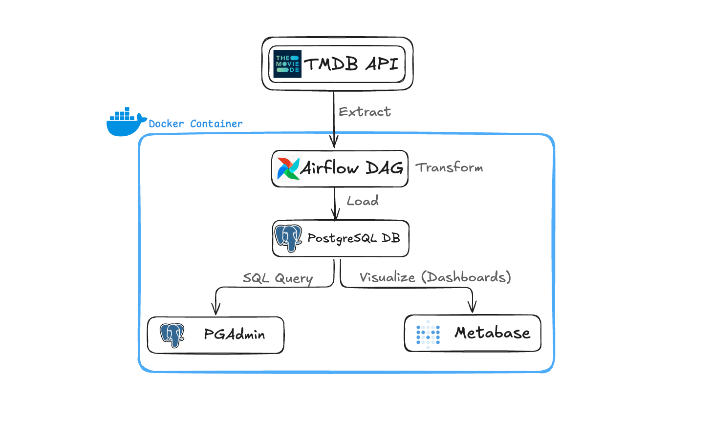
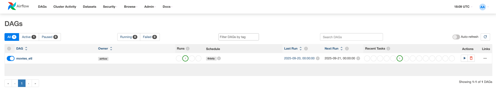
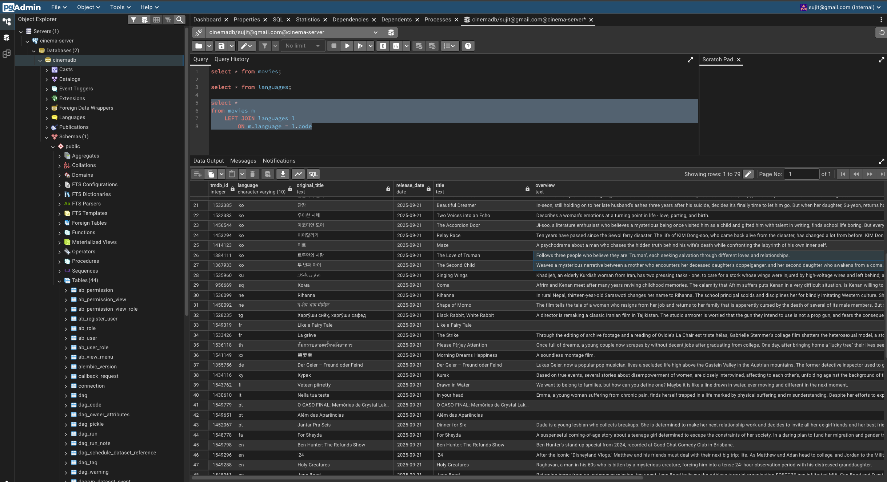
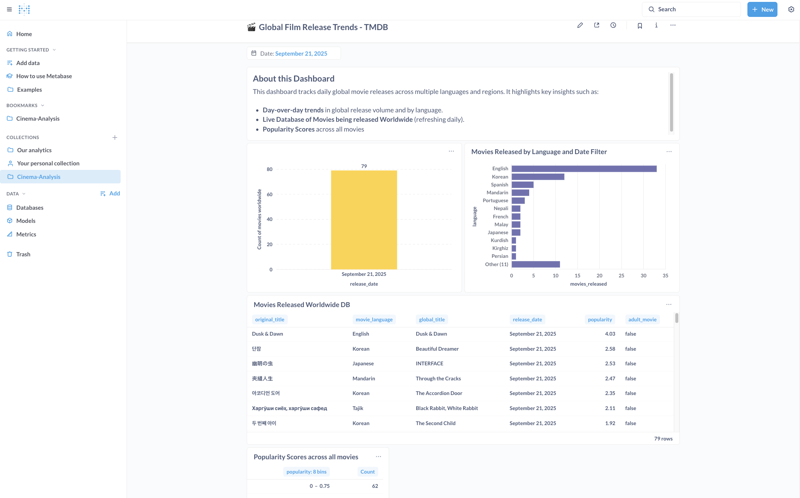
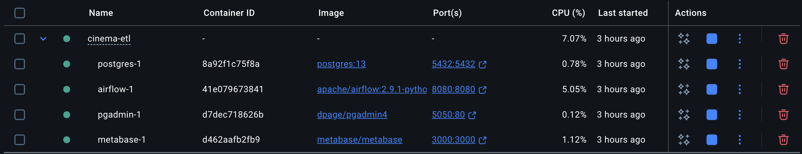

# 🎬 Cinema ETL (Airflow + Postgres + Metabase)

## 📖 Project Overview
This project is an end-to-end data pipeline and analytics project that tracks **daily worldwide movie releases** using **The Movie Database (TMDB) API**.  

It automates data ingestion, transformation, and visualization to deliver real-time insights into **global film release trends, language distribution, and popularity scores**.

## 🚀 Tech Stack (All Open Source) 
- **Python** → Data fetching from TMDB API & transformations inside Airflow tasks 
- **Apache Airflow** → Orchestration of the ETL pipeline (daily runs)  
- **PostgreSQL** → RDBMS for storing movies and languages tables
- **pgAdmin** → UI to write SQL queries, schema management, and validation  
- **Metabase** → Interactive dashboards for visualization and reporting
- **Docker** → Containerized setup for easy deployment

## 📂 Project Architecture



1. **Airflow DAG (`movies_etl`)**  
   - Python script fetches daily movie release data from TMDB APIs  
   - Transforms and loads into Postgres (`movies` and `languages` tables)  

   

2. **Postgres Database** 
   - `movies` table: stores daily release info (title, language, release date, popularity, adult flag, overview)  
   - `languages` table: reference table mapping language codes to names  

     

3. **Metabase Dashboard**  
   - Visualizes daily and cumulative insights such as:  
     - Movies released worldwide (daily counts)  
     - Language distribution of releases  
     - Popularity scores and top-performing titles
       
   

   ⚠️ **Important Note on Dashboards**  
   - This project does **not** ship with pre-built Metabase dashboards.  
   - Once the pipeline runs and data is available in **Postgres**, you will need to:  
      1. Connect **Metabase** to your local Postgres instance [straightforward one-time setup](https://www.metabase.com/docs/latest/databases/connections/postgresql).  
      2. Create your own dashboards, questions, and visualizations based on the `movies` and `languages` tables.  

---

## 🛠️ Setup & Installation

### 1. Clone Repository
```bash
git clone https://github.com/sujitanireddy/Cinema-ETL.git
cd Cinema-ETL
```

### 2. **Create your .env file**
```bash
cp .env.example .env
```

Then open .env and update the passwords of your choice and replace with your API key.

Sign in/Create account on TMDB website and copy your API key. You can get your API key from [here](https://developer.themoviedb.org/docs/getting-started).

You should have docker installed. You can install from [here](https://www.docker.com/products/docker-desktop). 

### 3. **Start the services**
   ```bash
   docker compose up --build
```
You can see Images being downloaded, containers starting in docker.desktop application.



### 4. **Access the tools**
- **Airflow:** http://localhost:8080
- **pgAdmin:** http://localhost:5050
- **Metabase:** http://localhost:3000

For logging in, use your credentials set in your .env file.

Run your DAGs using Airflow, Query your Database using pgAdmin and Visualize your data using Metabase.

---

## 🙌 Credits
- Took inspiration from [Weather Data Pipeline project](https://github.com/chiranjeevi-sagi/weather-data-pipeline)  
- Uses [TMDB API](https://developer.themoviedb.org/v4/reference/intro/getting-started) for fetching daily movie releases  

## 👤 Author
**Sujit Anireddy**  
📧 [anireddysujitreddy@gmail.com](mailto:anireddysujitreddy@gmail.com)  
